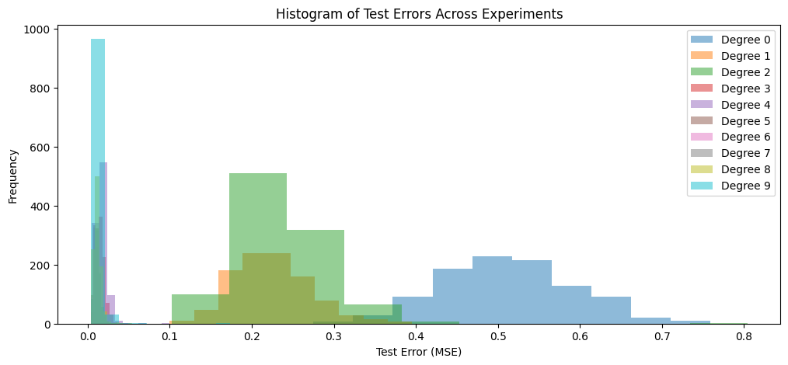

```python
import ace_tools_open as tools
import numpy as np
import matplotlib.pyplot as plt
import pandas as pd
from collections import Counter
from sklearn.preprocessing import PolynomialFeatures
from sklearn.pipeline import make_pipeline
from sklearn.linear_model import LinearRegression
from sklearn.model_selection import train_test_split, cross_val_score
```


```python
# Generate synthetic dataset
X = np.linspace(0, 1, 100).reshape(-1, 1)
y = np.sin(2 * np.pi * X).ravel() + np.random.normal(0, 0.1, X.shape[0])

# Split into training and test sets (80/20)
X_train, X_test, y_train, y_test = train_test_split(
    X, y, test_size=0.2, random_state=42
)

X_train, X_test, y_train, y_test = train_test_split(
    X, y, test_size=0.2,
)

# Define polynomial degrees from 0 to 9
degrees = list(range(10))
models = {}
test_errors = {}
cv_errors = {}

# Train models and compute errors
for degree in degrees:
    model = make_pipeline(PolynomialFeatures(degree), LinearRegression())
    model.fit(X_train, y_train)
    models[degree] = model
    test_errors[degree] = np.mean((model.predict(X_test) - y_test) ** 2)
    cv_errors[degree] = -np.mean(
        cross_val_score(
            model, X_train, y_train, scoring="neg_mean_squared_error", cv=10
        )
    )

# Convert errors to DataFrame
errors_df = pd.DataFrame(
    {
        "Degree": degrees,
        "Test Error (MSE)": [test_errors[d] for d in degrees],
        "CV Error (10-Fold MSE)": [cv_errors[d] for d in degrees],
    }
)

# Plot polynomial models with predictions
plt.figure(figsize=(12, 6))
plt.scatter(X, y, label="True Data", color="black", alpha=0.5)
X_plot = np.linspace(0, 1, 100).reshape(-1, 1)
for degree in degrees:
    y_pred = models[degree].predict(X_plot)
    plt.plot(X_plot, y_pred, label=f"Polynomial Degree {degree}")
plt.title("Comparison of Polynomial Models")
plt.xlabel("x")
plt.ylabel("f(x)")
plt.legend()
plt.show()

# Plot MSE per degree
plt.figure(figsize=(12, 5))
plt.plot(degrees, errors_df["Test Error (MSE)"], marker="o", label="Test Error (MSE)")
plt.plot(
    degrees,
    errors_df["CV Error (10-Fold MSE)"],
    marker="s",
    label="CV Error (10-Fold MSE)",
)
plt.xlabel("Polynomial Degree")
plt.ylabel("Mean Squared Error (MSE)")
plt.title("MSE and Cross-Validation Error vs. Polynomial Degree")
plt.legend()
plt.grid(True)
plt.show()


# Display errors
errors_df = pd.DataFrame({
    "Degree": degrees,
    "Test Error (MSE)": [test_errors[d] for d in degrees],
    "CV Error (10-Fold MSE)": [cv_errors[d] for d in degrees]
})
```


    

    


    

    


```python
tools.display_dataframe_to_user(name="Model Errors", dataframe=errors_df)
```

    Model Errors


<table id="itables_3cc58dae_d8be_4943_94e1_b94b6edd2013" class="display nowrap" data-quarto-disable-processing="true" style="table-layout:auto;width:auto;margin:auto;caption-side:bottom">
<thead>
    <tr style="text-align: right;">

      <th>Degree</th>
      <th>Test Error (MSE)</th>
      <th>CV Error (10-Fold MSE)</th>
    </tr>
  </thead><tbody><tr>
<td style="vertical-align:middle; text-align:left">
<a href=https://mwouts.github.io/itables/><svg class="main-svg" xmlns="http://www.w3.org/2000/svg" xmlns:xlink="http://www.w3.org/1999/xlink"
width="64" viewBox="0 0 500 400" style="font-family: 'Droid Sans', sans-serif;">
    <g style="fill:#d9d7fc">
        <path d="M100,400H500V357H100Z" />
        <path d="M100,300H400V257H100Z" />
        <path d="M0,200H400V157H0Z" />
        <path d="M100,100H500V57H100Z" />
        <path d="M100,350H500V307H100Z" />
        <path d="M100,250H400V207H100Z" />
        <path d="M0,150H400V107H0Z" />
        <path d="M100,50H500V7H100Z" />
    </g>
    <g style="fill:#1a1366;stroke:#1a1366;">
   <rect x="100" y="7" width="400" height="43">
    <animate
      attributeName="width"
      values="0;400;0"
      dur="5s"
      repeatCount="indefinite" />
      <animate
      attributeName="x"
      values="100;100;500"
      dur="5s"
      repeatCount="indefinite" />
  </rect>
        <rect x="0" y="107" width="400" height="43">
    <animate
      attributeName="width"
      values="0;400;0"
      dur="3.5s"
      repeatCount="indefinite" />
    <animate
      attributeName="x"
      values="0;0;400"
      dur="3.5s"
      repeatCount="indefinite" />
  </rect>
        <rect x="100" y="207" width="300" height="43">
    <animate
      attributeName="width"
      values="0;300;0"
      dur="3s"
      repeatCount="indefinite" />
    <animate
      attributeName="x"
      values="100;100;400"
      dur="3s"
      repeatCount="indefinite" />
  </rect>
        <rect x="100" y="307" width="400" height="43">
    <animate
      attributeName="width"
      values="0;400;0"
      dur="4s"
      repeatCount="indefinite" />
      <animate
      attributeName="x"
      values="100;100;500"
      dur="4s"
      repeatCount="indefinite" />
  </rect>
        <g style="fill:transparent;stroke-width:8; stroke-linejoin:round" rx="5">
            <g transform="translate(45 50) rotate(-45)">
                <circle r="33" cx="0" cy="0" />
                <rect x="-8" y="32" width="16" height="30" />
            </g>

            <g transform="translate(450 152)">
                <polyline points="-15,-20 -35,-20 -35,40 25,40 25,20" />
                <rect x="-15" y="-40" width="60" height="60" />
            </g>

            <g transform="translate(50 352)">
                <polygon points="-35,-5 0,-40 35,-5" />
                <polygon points="-35,10 0,45 35,10" />
            </g>

            <g transform="translate(75 250)">
                <polyline points="-30,30 -60,0 -30,-30" />
                <polyline points="0,30 -30,0 0,-30" />
            </g>

            <g transform="translate(425 250) rotate(180)">
                <polyline points="-30,30 -60,0 -30,-30" />
                <polyline points="0,30 -30,0 0,-30" />
            </g>
        </g>
    </g>
</svg>
</a>
Loading ITables v2.2.4 from the internet...
(need <a href=https://mwouts.github.io/itables/troubleshooting.html>help</a>?)</td>
</tr></tbody>
</table>
<link href="https://www.unpkg.com/dt_for_itables@2.0.13/dt_bundle.css" rel="stylesheet">
<script type="module">
    import {DataTable, jQuery as $} from 'https://www.unpkg.com/dt_for_itables@2.0.13/dt_bundle.js';

    document.querySelectorAll("#itables_3cc58dae_d8be_4943_94e1_b94b6edd2013:not(.dataTable)").forEach(table => {
        if (!(table instanceof HTMLTableElement))
            return;

        // Define the table data
        const data = [[0, 0.535089, 0.557408], [1, 0.210299, 0.251372], [2, 0.210838, 0.261296], [3, 0.007116, 0.017067], [4, 0.006862, 0.018204], [5, 0.00403, 0.012577], [6, 0.00409, 0.013229], [7, 0.004184, 0.013643], [8, 0.003984, 0.013501], [9, 0.004368, 0.013439]];

        // Define the dt_args
        let dt_args = {"layout": {"topStart": null, "topEnd": null, "bottomStart": null, "bottomEnd": null}, "order": [], "warn_on_selected_rows_not_rendered": true};
        dt_args["data"] = data;


        new DataTable(table, dt_args);
    });
</script>


```python
# Find the best degrees with the least errors
best_test_degree = errors_df.loc[errors_df["Test Error (MSE)"].idxmin(), "Degree"]
best_cv_degree = errors_df.loc[errors_df["CV Error (10-Fold MSE)"].idxmin(), "Degree"]
print(f"Best degree based on Test Error: {best_test_degree}")
print(f"Best degree based on CV Error: {best_cv_degree}")
```

    Best degree based on Test Error: 8
    Best degree based on CV Error: 5


For Reproducibility, let's run the testing and cross validation several times


```python
# Define polynomial degrees from 0 to 9
num_experiments = 1000
test_errors_all = {degree: [] for degree in degrees}
cv_errors_all = {degree: [] for degree in degrees}

# Perform multiple evaluations
for _ in range(num_experiments):
    y = np.sin(2 * np.pi * X).ravel() + np.random.normal(0, 0.1, X.shape[0])
    X_train, X_test, y_train, y_test = train_test_split(X, y, test_size=0.2)

    for degree in degrees:
        model = make_pipeline(PolynomialFeatures(degree), LinearRegression())
        model.fit(X_train, y_train)
        test_errors_all[degree].append(np.mean((model.predict(X_test) - y_test) ** 2))
        cv_errors_all[degree].append(
            -np.mean(
                cross_val_score(
                    model, X_train, y_train, scoring="neg_mean_squared_error", cv=10
                )
            )
        )

# Convert errors to DataFrame
errors_df = pd.DataFrame(
    {
        "Degree": degrees,
        "Mean Test Error (MSE)": [np.mean(test_errors_all[d]) for d in degrees],
        "Mean CV Error (10-Fold MSE)": [np.mean(cv_errors_all[d]) for d in degrees],
    }
)

# Plot histograms for errors per degree
plt.figure(figsize=(12, 5))
for degree in degrees:
    plt.hist(test_errors_all[degree], alpha=0.5, label=f"Degree {degree}")
plt.xlabel("Test Error (MSE)")
plt.ylabel("Frequency")
plt.title("Histogram of Test Errors Across Experiments")
plt.legend()
plt.show()

plt.figure(figsize=(12, 5))
for degree in degrees:
    plt.hist(cv_errors_all[degree], alpha=0.5, label=f"Degree {degree}")
plt.xlabel("CV Error (MSE)")
plt.ylabel("Frequency")
plt.title("Histogram of CV Errors Across Experiments")
plt.legend()
plt.show()
```


    

    


    

    


Let's focus on smaller errors:


```python
# Plot histograms for errors per degree
plt.figure(figsize=(12, 5))
for degree in degrees:
    plt.hist(test_errors_all[degree], alpha=0.5, label=f"Degree {degree}")
plt.xlabel("Test Error (MSE)")
plt.xlim(0, 0.05)
plt.ylabel("Frequency")
plt.title("Histogram of Test Errors Across Experiments")
plt.legend()
plt.show()

plt.figure(figsize=(12, 5))
for degree in degrees:
    plt.hist(cv_errors_all[degree], alpha=0.5, label=f"Degree {degree}")
plt.xlabel("CV Error (MSE)")
plt.xlim(0, 0.05)
plt.ylabel("Frequency")
plt.title("Histogram of CV Errors Across Experiments")
plt.legend()
plt.show()
```


    

    


    

    

